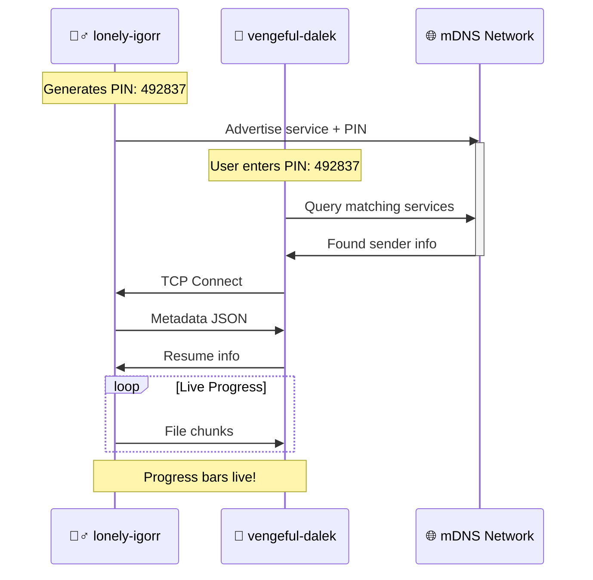

<div align="center">

# 🧪⚡ **CYPHER-SHARE** ⚡🧪
<div style="background: linear-gradient(90deg, #1a1a2e, #16213e, #0f3460, #e94560); 
            color: #ffffff; padding: 3rem; border-radius: 25px; 
            box-shadow: 0 30px 60px rgba(233,69,96,0.5); 
            font-family: 'Courier New', monospace; 
            font-size: 1.8rem; font-weight: bold; 
            text-shadow: 4px 4px 8px rgba(0,0,0,1); 
            border: 5px solid #e94560; 
            margin: 1.5rem 0;">

**🧟‍♂️ IT'S ALIIIIVE! 🧟‍♂️** ⚡🔬💀🧪  
**[https://github.com/kencypher56/cypher-share](https://github.com/kencypher56/cypher-share)**  
**6-DIGIT PIN • mDNS • FRANKENSTEIN CLI**

</div>

[](https://www.python.org/)
[](https://github.com/kencypher56/cypher-share)
[](https://choosealicense.com/licenses/mit/)
[](https://github.com/kencypher56/cypher-share)

<div style="background: #0f0f23; color: #00ff88; padding: 2rem; 
            border-radius: 15px; border-left: 8px solid #e94560; 
            font-size: 1.3rem; font-weight: bold; margin: 2rem 0;">
⚡ **NO CLOUD** • **NO USB** • **NO IP CONFIG** • **LOCAL NETWORK LIGHTNING** ⚡
</div>

</div>

---

<div align="center">

## ✨ **THE CREATURE'S POWERS** ✨

<div style="display: grid; grid-template-columns: repeat(auto-fit, minmax(280px, 1fr)); 
            gap: 1.5rem; margin: 2rem 0;">

<div style="background: linear-gradient(135deg, #16213e, #1a1a2e); 
            padding: 2rem; border-radius: 15px; border: 3px solid #e94560;">
<div style="font-size: 3rem; color: #00ff88; margin-bottom: 1rem;">🔍</div>
**Zero-Conf Discovery**<br>
<em>mDNS/Zeroconf auto-finds sender instantly ⚡</em>
</div>

<div style="background: linear-gradient(135deg, #16213e, #1a1a2e); 
            padding: 2rem; border-radius: 15px; border: 3px solid #e94560;">
<div style="font-size: 3rem; color: #ffaa00; margin-bottom: 1rem;">🔐</div>
**PIN Handshake**<br>
<em>Simple 6-digit code secures session 🛡️</em>
</div>

<div style="background: linear-gradient(135deg, #16213e, #1a1a2e); 
            padding: 2rem; border-radius: 15px; border: 3px solid #e94560;">
<div style="font-size: 3rem; color: #00ccff; margin-bottom: 1rem;">📁</div>
**Files & Folders**<br>
<em>Preserves perfect structure 📂</em>
</div>

<div style="background: linear-gradient(135deg, #16213e, #1a1a2e); 
            padding: 2rem; border-radius: 15px; border: 3px solid #e94560;">
<div style="font-size: 3rem; color: #ff4488; margin-bottom: 1rem;">📊</div>
**Live Progress**<br>
<em>Bars, speed, ETA on both ends 📈</em>
</div>

<div style="background: linear-gradient(135deg, #16213e, #1a1a2e); 
            padding: 2rem; border-radius: 15px; border: 3px solid #e94560;">
<div style="font-size: 3rem; color: #88ff88; margin-bottom: 1rem;">🔄</div>
**Auto-Resume**<br>
<em>Interrupts? Picks up EXACTLY where left off 🔧</em>
</div>

<div style="background: linear-gradient(135deg, #16213e, #1a1a2e); 
            padding: 2rem; border-radius: 15px; border: 3px solid #e94560;">
<div style="font-size: 3rem; color: #ffaa44; margin-bottom: 1rem;">🎨</div>
**Frankenstein UI**<br>
<em>Lightning bolts, emojis, living terminal! ⚡🧟‍♂️</em>
</div>

</div>

</div>

<div align="center">
<hr style="border: 4px solid #e94560; width: 60%; margin: 3rem 0;">
</div>

---

<div align="center">

## 🧰 **MAD SCIENCE STACK** 🧰

| **⚡ Component** | **🔬 Technology** |
|------------------|-------------------|
| **Core** | Python 3.11 🐍 |
| **Discovery** | `zeroconf` (mDNS) 🌐 |
| **Network** | Custom TCP protocol 📡 |
| **UI Magic** | `rich` + `questionary` + `prompt_toolkit` 🎨 |
| **Persistence** | JSON resume + `logging` 💾 |
| **QR Codes** | `qrcode` (optional) 📱 |
| **Monitoring** | `psutil` system info 🖥️ |

</div>

---

<div align="center">

## 🔬 **THE PERFECT EXPERIMENT** 🔬



**🧪 Key Innovation:** 4-byte length-prefixed JSON prevents truncation!

**Metadata (Sender → Receiver):**
```json
{
  "device": "lonely-igorr",
  "pin": "492837",
  "total_files": 42,
  "total_size": 1234567890,
  "files": [
    {"rel_path": "docs/report.pdf", "size": 1048576},
    {"rel_path": "photos/family.jpg", "size": 5242880}
  ]
}
```

**Resume Reply (Receiver → Sender):**
```json
{
  "device": "vengeful-dalek",
  "docs/report.pdf": {"transferred": 524288}
}
```

</div>

---

<div align="center">

## 🚀 **WHY THIS MONSTER DOMINATES** 🚀

| 💀 **Obsolete Methods** | 🧟‍♂️ **Cypher-Share** |
|-------------------------|----------------------|
| 🌐 Requires internet | 🚫 **100% Local** |
| 📝 Manual IP entry | 🔐 **Just 6-digit PIN** |
| 🐌 Cloud relay | ⚡ **Direct TCP** |
| 💥 No recovery | 🔄 **Byte-perfect resume** |
| 😴 Dull UI | 🎭 **Immersive drama** |
| 🔒 Complex auth | 🛡️ **Simple PIN** |

<div style="font-size: 3rem; color: #e94560; margin: 2rem 0; 
            text-shadow: 2px 2px 4px #000;">
**🧟‍♂️⚡ IT'S ALIVE! ALIVE! ⚡🧟‍♂️**
</div>

</div>

---

<div align="center">

## 📦 **BREATHE LIFE INTO IT** 📦

### 🪄 **One-Click Resurrection** *(Recommended)*
```bash
git clone https://github.com/kencypher56/cypher-share
cd cypher-share
python setup.py
```

**`setup.py` creates:**
- ✅ OS detection + Miniconda install
- ✅ `cypher-share` conda environment  
- ✅ Python 3.11 + all dependencies
- ✅ Activation instructions

```bash
conda activate cypher-share
```

### 🛠️ **Manual Creation**
```bash
python -m venv venv
source venv/bin/activate     # Linux/macOS
# venv\Scripts\activate      # Windows
pip install -r requirements.txt
```

</div>

---

<div align="center">

## 🕹️ **ACTIVATE THE BEAST** 🕹️

```bash
python run.py
```

```
🧪⚡  CYPHER-SHARE LABORATORY  ⚡🧪
     IT'S ALIIIIVE!

? Choose your EXPERIMENT:
  ⚡ Send Experiment         📤
  ⚡ Receive Experiment      📥
  📡 System Inspection      🖥️
  ⚡ Exit Laboratory         💀
  ↓ Use arrow keys
```

### 📤 **SENDER PROTOCOL**
```
1. Send Experiment → Enter file paths (TAB complete!)
2. AUTO: "electric-frankenstein" + PIN: 492837 ⚡
3. AWAITS receiver → Live progress bars activate!
```

### 📥 **RECEIVER PROTOCOL**
```
1. Receive Experiment → Enter sender PIN
2. mDNS scans → Finds match → TCP lightning!
3. Saves to ~/Desktop/cypher-share/ (structure preserved)
```

### 🖥️ **SYSTEM INSPECTION**
**CPU/RAM/GPU usage with electric progress bars!** ⚡📊

</div>

---

<div align="center">

## 🧟‍♂️ **ANATOMY OF THE CREATURE** 🧟‍♂️

```
cypher-share/                          # 🧪 The Living Beast
├── setup.py                          # 🪄 One-click resurrection
├── requirements.txt                   # 📦 Life ingredients
├── run.py                            # ⚡ Main brain
├── design.py                         # 🎨 Frankenstein visuals
├── interactive.py                    # 🕹️ Menus & prompts
├── sysinfo.py                        # 🖥️ Vital monitoring
├── name_generator.py                 # 🧠 "lonely-igorr" names
├── pin_generator.py                  # 🔢 6-digit PINs
├── operations.py                     # 📂 File dissection
├── protocol.py                       # 📡 Length-prefixed JSON
├── send.py                           # 📤 Sender electricity
├── receive.py                        # 📥 Receiver hunger
├── resume.py                         # 🔄 Immortality system
├── logger.py                         # 🧾 Eternal experiment log
└── network.py                        # 🌐 Local network veins
```

</div>

---

<div align="center">

## 📜 **ETERNAL MEMORY** 📜

- **🧾 Transfer Log:** `~/cypher-share.log`  
  *Timestamps, devices, success/failures*
- **🔄 Resume State:** `~/.cypher-share-resume.json`  
  *Byte-perfect recovery from interruptions*

**Sample Log Entry:**
```
2026-03-17 14:28:23 ⚡ lonely-igorr → vengeful-dalek
PIN: 492837 | 42 files | 1.15GB | COMPLETED ✅
```

</div>

---

<div align="center">

## 🧪 **TROUBLESHOOTING LIGHTNING** 🧪

| ❌ **GLITCH** | ✅ **LIGHTNING FIX** |
|---------------|---------------------|
| `"No sender found"` | Same WiFi/Ethernet? mDNS port 5353 UDP open? |
| `Connection reset` | Network hiccup? **Resume auto-recovers!** |
| `Conda install fails` | [Manual Miniconda](https://docs.conda.io/en/latest/miniconda.html) |
| `UI looks broken` | Modern terminal + 100+ columns + true color |

**🔥 Pro Tip:** Disable firewalls temporarily for testing ⚡

</div>

---

<div align="center">

## 🤝 **JOIN THE MAD SCIENCE** 🤝

1. 🍴 **[Fork on GitHub](https://github.com/kencypher56/cypher-share)**
2. 🔧 `git checkout -b feature/ElectrifyThis`
3. ✨ Code your madness
4. 🚀 `git commit -m "Add lightning feature ⚡"`
5. 📡 `git push origin feature/ElectrifyThis`
6. 🌟 **Open Pull Request!**

**Preserve the Frankenstein spirit!** 😈⚡🧟‍♂️

</div>

---

<div align="center" style="background: linear-gradient(45deg, #1a1a2e, #16213e, #0f3460, #e94560); 
                          padding: 4rem; border-radius: 30px; 
                          border: 6px solid #ffffff; margin: 4rem 0;
                          box-shadow: 0 40px 80px rgba(233,69,96,0.6);">

<div style="font-size: 5rem; margin: 1.5rem 0; color: #00ff88;">⚡🧪📡🧟‍♂️⚡</div>

# **CYPHER-SHARE**  
**[https://github.com/kencypher56/cypher-share](https://github.com/kencypher56/cypher-share)**

**MIT License** • **Linux/macOS/Windows** • **Mad Science 2026**

<div style="font-size: 3rem; color: #e94560; margin: 2rem 0;
            text-shadow: 3px 3px 6px #000; font-family: 'Courier New';">
**"IT'S ALIIIIVE! ALIVE! ALIIIIVE!!!"** ⚡🧟‍♂️⚡
</div>

<div style="font-size: 1.8rem; color: #b8b8ff; font-style: italic;">
**— Dr. Cypherstein, March 2026** 🧪⚡🔬
</div>

</div>

<div align="center">
<hr style="border: 5px solid #e94560; width: 70%; margin: 3rem 0;">
<div style="font-size: 2rem; color: #8888ff; font-family: 'Courier New';">
**🧪⚡ END OF TRANSMISSION ⚡🧪**
</div>
<div style="font-size: 1.2rem; color: #666; margin-top: 1rem;">
[https://github.com/kencypher56/cypher-share](https://github.com/kencypher56/cypher-share)
</div>
</div>
