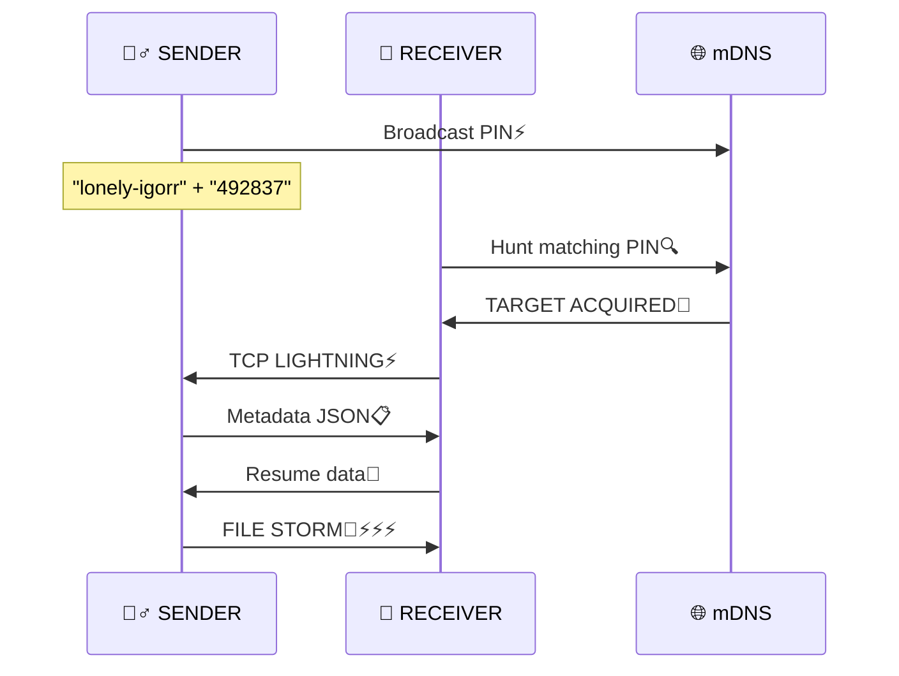

<div align="center">

# 🧪⚡ **CYPHER-SHARE** ⚡🧪

<div style="background: linear-gradient(90deg, #1a1a2e, #16213e, #0f3460); 
            color: #e94560; padding: 2.5rem; border-radius: 20px; 
            box-shadow: 0 25px 50px rgba(233,69,96,0.4); 
            font-family: 'Courier New', monospace; 
            font-size: 1.6rem; font-weight: bold; 
            text-shadow: 3px 3px 6px rgba(0,0,0,0.9); 
            border: 4px solid #e94560; 
            margin: 1rem 0;">

**🧟‍♂️ IT'S ALIIIIVE! 🧟‍♂️** ⚡🔬💀  
**PEER-TO-PEER FILE TRANSFER**  
**6-DIGIT PIN • mDNS • FRANKENSTEIN CLI**

</div>

<div style="background: #0f0f23; color: #00ff88; padding: 1.5rem; 
            border-radius: 12px; border-left: 6px solid #e94560; 
            font-size: 1.2rem; font-weight: bold; margin: 1.5rem 0;">
⚡ **NO CLOUD** • **NO USB** • **NO IP HUNTING** • **PURE LOCAL LIGHTNING** ⚡
</div>

</div>

---

<div align="center">

## ✨ **FEATURES OF THE CREATURE** ✨

| 🎯 **POWER** | 🧪 **DESCRIPTION** |
|-------------|-------------------|
| 🔍 **Zero-conf** | mDNS auto-finds sender ⚡ |
| 🔐 **PIN Lock** | 6-digit code secures ⚡️ |
| 📁 **Files+Folders** | Perfect structure preserved 📂 |
| 📊 **Live Progress** | Bars + speed + ETA everywhere 📈 |
| 🔄 **Resume** | Interrupts? REVIVES instantly! 🔧 |
| 🧾 **Logs** | `~/cypher-share.log` eternal record 📜 |
| 🖥️ **System Scan** | CPU/RAM/GPU with color bars 🖥️ |
| 🎨 **Mad UI** | Lightning + emojis + NARRATIVE ⚡🧟‍♂️ |
| 🌍 **Everywhere** | Linux/macOS/Windows 👻 |

</div>

<div align="center">

</div>

---

<div align="center">

## 🧰 **THE MAD SCIENCE** 🧰

| **⚡ Component** | **🔬 Technology** |
|------------------|-------------------|
| **Language** | Python 3.11 🐍 |
| **Discovery** | `zeroconf` mDNS 🌐 |
| **Network** | TCP sockets (custom) 📡 |
| **CLI Magic** | `rich` + `questionary` + `prompt_toolkit` 🎨 |
| **Resume** | JSON + `logging` 💾 |
| **QR Bonus** | `qrcode` (optional) 📱 |
| **System** | `psutil` 🖥️ |

</div>

---

<div align="center">

## 🔬 **THE EXPERIMENT** 🔬



### 📡 **PROTOCOL** (Length-prefixed JSON)
```json
{
  "device": "electric-frankenstein",
  "pin": "492837",
  "total_files": 42,
  "total_size": 1234567890,
  "files": [{"rel_path": "docs/secrets.pdf", "size": 1048576}]
}
```

</div>

---

<div align="center">

## 🚀 **WHY THIS MONSTER RULES** 🚀

| 💀 **DEAD METHODS** | 🧟‍♂️ **CYPHER-SHARE** |
|---------------------|----------------------|
| 🌐 Internet required | 🚫 **LOCAL ONLY** |
| 📝 Manual IP typing | 🔐 **6-DIGIT PIN** |
| 🐌 Cloud slowness | ⚡ **DIRECT TCP** |
| 💥 No recovery | 🔄 **AUTO-RESUME** |
| 😴 Boring interface | 🎭 **FRANKENSTEIN DRAMA** |

<div style="font-size: 2.5rem; color: #e94560; margin: 1rem 0;">
**🧟‍♂️ IT'S ALIVE! ALIVE! ⚡** 
</div>

</div>

---

<div align="center">

## 📦 **CREATE THE BEAST** 📦

### 🪄 **One-Click Resurrection**
```bash
git clone <your-repo-url>
cd cypher-share
python setup.py
```
**Auto-magically:**
- ✅ Detects OS/architecture
- ✅ Installs Miniconda  
- ✅ Creates `cypher-share` env
- ✅ All dependencies
- ✅ Activation instructions

```bash
conda activate cypher-share
```

### 🛠️ **Manual Creation**
```bash
python -m venv venv
source venv/bin/activate  # Linux/macOS
# venv\Scripts\activate   # Windows  
pip install -r requirements.txt
```

</div>

---

<div align="center">

## 🕹️ **ACTIVATE THE CREATURE** 🕹️

```bash
python run.py
```

```
⚡🧪  LABORATORY ONLINE  🧪⚡

? What EXPERIMENT today?
  ⚡ Send Experiment      📤
  ⚡ Receive Experiment   📥
  📡 System Inspection   🖥️
  ⚡ Exit Laboratory      💀
```

### 📤 **SENDER MODE**
1. **Send Experiment** → Pick files/folders
2. **AUTO:** Device name + 6-digit PIN ⚡
3. **WAIT:** Receiver connects → **LIGHTNING!**

### 📥 **RECEIVER MODE**  
1. **Receive Experiment** → Enter PIN
2. **AUTO:** Finds sender → Downloads
3. **SAVES:** `~/Desktop/cypher-share/`

### 🖥️ **SYSTEM SCAN**
CPU/RAM/GPU with **electric progress bars** ⚡📊

</div>

---

<div align="center">

## 🧟‍♂️ **CREATURE ANATOMY** 🧟‍♂️

```
cypher-share/
├── setup.py              # 🪄 One-click LIFE
├── run.py                # ⚡ Main brain
├── design.py             # 🎨 Frankenstein UI
├── interactive.py        # 🕹️ Menus/PINs
├── sysinfo.py            # 🖥️ Vital signs
├── name_generator.py     # 🧠 "lonely-igorr"
├── send.py              # 📤 Sender heart
├── receive.py            # 📥 Receiver hunger
├── protocol.py           # 📡 Electric signals
└── resume.py             # 🔄 Immortality
```

</div>

---

<div align="center">

## 📜 **ETERNAL RECORDS** 📜
- **🧾 Logs:** `~/cypher-share.log`
- **🔄 Resume:** `~/.cypher-share-resume.json`

</div>

---

<div align="center">

## 🧪 **TROUBLESHOOTING** 🧪

| ❌ **GLITCH** | ✅ **FIX** |
|---------------|------------|
| "No sender" | Same WiFi? mDNS port 5353? |
| Connection cut | **Resume revives** automatically |
| Conda fails | [Manual Miniconda](https://docs.conda.io/en/latest/miniconda.html) |
| Glitchy UI | Modern terminal (100+ cols) |

</div>

---

<div align="center">

## 🤝 **HELP THE MAD SCIENCE** 🤝

1. 🍴 **Fork repository**
2. 🔧 **Branch:** `feature/ElectrifyThis`
3. ✨ **Code madness**
4. 🚀 **Commit** → **Push** → **PR**

**Keep lightning alive!** ⚡😈🧟‍♂️

</div>

---

<div align="center" style="background: linear-gradient(45deg, #1a1a2e, #16213e); 
                          padding: 3rem; border-radius: 25px; 
                          border: 5px solid #e94560; margin: 3rem 0;">

<div style="font-size: 4rem; margin: 1rem 0;">⚡🧪📡🧟‍♂️</div>

# **CYPHER-SHARE**  
**MIT License** • **Cross-Platform** • **Mad Science 2026**

<div style="font-size: 2.2rem; color: #00ff88; margin: 1.5rem 0;">
**"IT'S ALIIIIVE! ALIVE!"** ⚡🧟‍♂️
</div>

**— Dr. Cypherstein** 🧪⚡

</div>

<div align="center">
<hr style="border: 3px solid #e94560; width: 50%;">
<div style="font-size: 1.5rem; color: #b8b8ff;">
**⚡ END TRANSMISSION ⚡**
</div>
</div>
