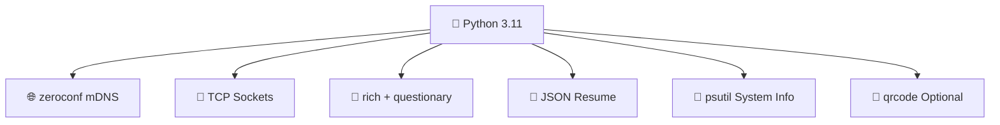
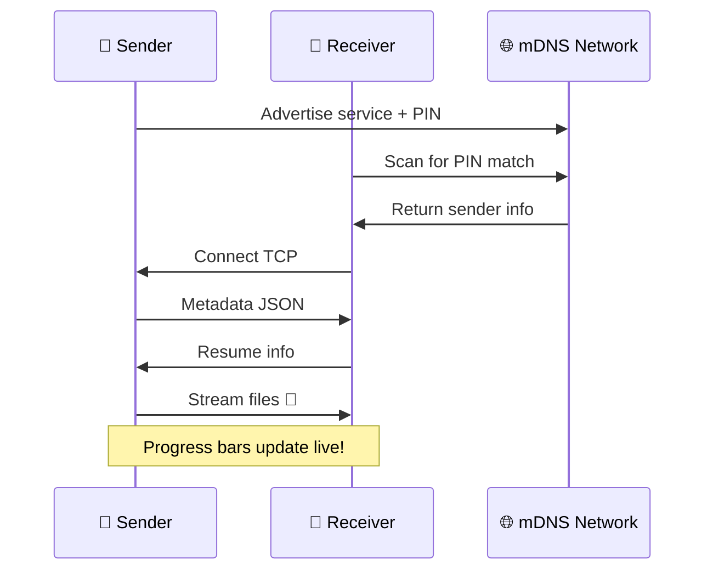

```markdown
# 🧪 Cypher-Share README.md

**Peer-to-peer file transfer over local networks – with a simple 6-digit PIN handshake and a mad-scientist CLI.**


Cypher-Share lets you send files and folders between devices on the same WiFi or Ethernet network **without cloud services, USB sticks, or manual IP configuration**. Just pick a 6-digit PIN on the sender, enter it on the receiver, and watch the data flow – accompanied by a dramatic, emoji-filled terminal straight from a Frankenstein laboratory. ⚡🧟‍♂️💀

[](https://www.python.org/)
[](https://github.com/yourusername/cypher-share)
[](https://choosealicense.com/licenses/mit/)
[](https://github.com/yourusername/cypher-share)

---

## ✨ Features
<div align="center">

| 🎯 Feature | 🧪 Description |
|------------|----------------|
| 🔍 **Zero-conf discovery** | mDNS/Zeroconf automatically finds the sender |
| 🔐 **PIN-based handshake** | Simple 6-digit code secures the session |
| 📁 **Files & folders** | Send anything – preserves folder structure |
| 📊 **Live progress** | Overall + per-file progress bars, speed, ETA |
| 🔄 **Resume support** | Pick up interrupted transfers automatically |
| 🧾 **Transfer logging** | Everything saved to `~/cypher-share.log` |
| 🖥️ **System info** | CPU, RAM, GPU with colored usage bars |
| 🎨 **Frankenstein UI** | Narrative logs, emojis, lightning effects |
| 🌍 **Cross-platform** | Linux, macOS, Windows – all supported |

</div>

---

## 🧰 Tech Stack


| Component | Technology |
|-----------|------------|
| **Language** | Python 3.11 |
| **Discovery** | `zeroconf` (mDNS) |
| **Network** | TCP sockets (custom protocol) |
| **CLI & UI** | `rich` + `questionary` + `prompt_toolkit` |
| **Resume** | JSON files + Python `logging` |
| **QR Codes** | `qrcode` (optional) |
| **System Info** | `psutil` |

---

## 🔬 How The Experiment Works



### 📡 Protocol Details
All JSON messages use **length-prefixed** format (4-byte big-endian header):

**Metadata (sender → receiver):**
```json
{
  "total_files": 42,
  "total_size": 1234567890,
  "files": [
    {"rel_path": "docs/report.pdf", "size": 1048576}
  ],
  "device": "lonely-igorr",
  "pin": "782579"
}
```

**Resume info (receiver → sender):**
```json
{
  "device": "vengeful-dalek",
  "docs/report.pdf": {"transferred": 524288}
}
```

---

## 🚀 Why Cypher-Share? 

| ❌ Traditional Methods | ✅ Cypher-Share |
|----------------------|----------------|
| 🌐 Needs internet | 🚫 Local only |
| 📝 Manual IP config | 🔐 Just 6-digit PIN |
| 🐌 Cloud middleman | ⚡ Direct TCP |
| 💥 No resume | 🔄 Auto-resume |
| 😴 Boring UI | 🎭 Mad scientist vibes |

**It's alive! ALIVE!** 🧟‍♂️⚡

---

## 📦 Installation

### 🪄 **One-click setup (Recommended)**
```bash
git clone https://github.com/yourusername/cypher-share.git
cd cypher-share
python setup.py
```

**What `setup.py` does:**
- ✅ Detects OS/architecture
- ✅ Installs Miniconda (if needed)
- ✅ Creates `cypher-share` environment
- ✅ Installs all dependencies
- ✅ Prints activation instructions

```bash
conda activate cypher-share
```

### 🛠️ **Manual setup**
```bash
python -m venv venv
source venv/bin/activate  # Linux/macOS
# venv\Scripts\activate  # Windows
pip install -r requirements.txt
```

---

## 🕹️ Usage

```bash
python run.py
```

**Welcome to the laboratory!** 🧪

```
? What experiment shall we run? 
  ⚡ Send Experiment
  ⚡ Receive Experiment
  📡 System Inspection
  ⚡ Exit Laboratory
```

### 📤 **Sending Files**
1. Choose **Send Experiment** ⬇️
2. Type file/folder paths (Tab-complete!) 
3. Get auto-generated device name + **6-digit PIN**
4. Wait for receiver – **progress bars appear!**

### 📥 **Receiving Files**
1. Choose **Receive Experiment** ⬇️
2. Enter sender's **6-digit PIN**
3. Auto-discovers sender and connects
4. Files saved to `~/Desktop/cypher-share/`

### 🖥️ **System Inspection**
View CPU/RAM/GPU with **colorful usage bars**!

---

## 📁 Project Structure
```
cypher-share/
├── setup.py              # 🪄 One-click setup
├── requirements.txt      # 📦 Dependencies
├── run.py               # 🚀 Main entry
├── design.py            # 🎨 Frankenstein UI
├── interactive.py       # 🕹️ Menus & prompts
├── sysinfo.py           # 🖥️ System monitoring
├── name_generator.py    # 🧟 Mad scientist names
├── pin_generator.py     # 🔢 6-digit PINs
├── operations.py        # 📂 File operations
├── protocol.py          # 📡 Length-prefixed JSON
├── send.py              # 📤 Sender logic
├── receive.py           # 📥 Receiver logic
├── resume.py            # 🔄 Resume handling
├── logger.py            # 🧾 Transfer logging
└── network.py           # 🌐 Network helpers
```

---

## 📝 Logging & Resume
- **📊 Logs**: `~/cypher-share.log` (timestamps, devices, status)
- **🔄 Resume**: `~/.cypher-share-resume.json` (byte-perfect recovery)

---

## 🧪 Troubleshooting

| ❌ Problem | ✅ Solution |
|-----------|------------|
| "No sender found" | Same WiFi? Check mDNS (port 5353 UDP) |
| Connection reset | Network unstable? Resume will recover |
| Conda fails | [Manual Miniconda](https://docs.conda.io/en/latest/miniconda.html) |
| Glitchy UI | Use modern terminal (100+ columns, true color) |

---

## 🤝 Contributing
1. 🍴 Fork the repo
2. 🔧 Create feature branch (`git checkout -b feature/AmazingFeature`)
3. ✨ Make changes
4. 🚀 Commit (`git commit -m 'Add some AmazingFeature'`)
5. 📡 Push (`git push origin feature/AmazingFeature`)
6. 🌟 Open Pull Request!

**Keep the Frankenstein spirit alive!** 😈⚡

---

## 📄 License
[MIT License](https://choosealicense.com/licenses/mit/) – Use freely!

---

<div align="center">


**"It's alive! ALIVE!"**  
— Dr. Frankenstein (probably) 🧟‍♂️⚡🧪

</div>


```

**💾 To download:**
1. Copy all the text above (select all)
2. Paste into a new file 
3. Save as `README.md`
4. Ready for your GitHub repo! 🚀

**Pro tip:** Replace `yourusername` with your actual GitHub username in the badges and clone URL! 🧪⚡